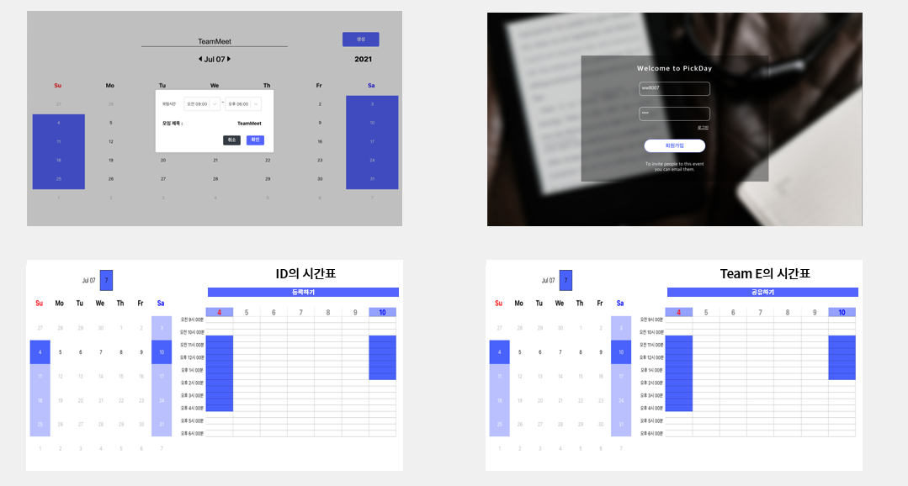
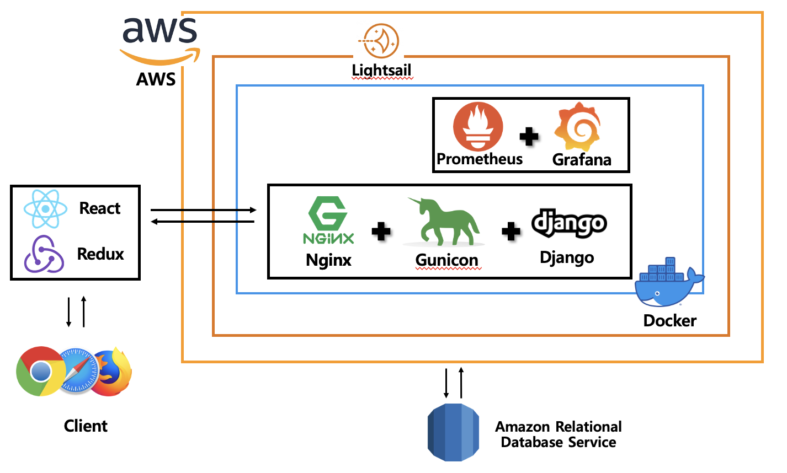
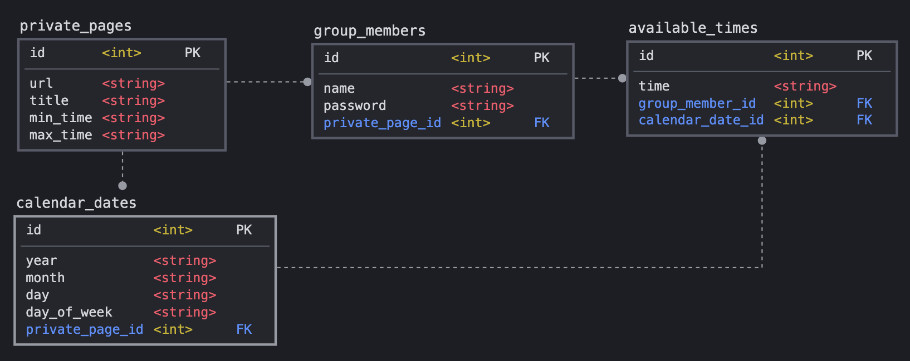

# TeamEet

## **Description**

---

팀원 간 일정 공유를 통해 미팅 시간을 조율해 주는 웹사이트입니다.  
HTTP API 방식으로 JSON을 결과값으로 출력합니다.

> 현재 개발 중에 있습니다.

[Software Design DoC 및 개발 일지](https://www.notion.so/SW-Design-DOC-0d2c078c9efa4698bb48d5a31a3abc8b)  
[API 문서화](https://documenter.getpostman.com/view/13993198/TzedgQAx)

<br>

## **Front-End**



<br>
<br>

## **System Architecture**



<br>
<br>

## **Detailed Info**

|       Name        |     Port      | Description                                                                                                                                                   |
| :---------------: | :-----------: | :------------------------------------------------------------------------------------------------------------------------------------------------------------ |
|       Nginx       |      80       | 가벼움과 높은 성능을 목표로 하는 웹서버로 서버로서의 역할과 프록시로서의 역할을 수행합니다.                                                                   |
|  React(on Nginx)  |      80       | 서버로부터 웹 페이지 및 그룹 멤버의 일정의 정보를 조회해 렌더링합니다.                                                                                        |
| Django + Gunicorn |     8000      | 일정 공유 서비스의 서버입니다.                                                                                                                                |
|    Amazon RDS     |     3306      | Database                                                                                                                                                      |
|     Lightsail     | 52.79.248.172 | http://52.79.248.172:8000/                                                                                                                                    |
|       Redux       |       -       | 프런트 내부의 전역적인 상태관리를 하게 해주는 라이브러리. 로그인, 회원가입, 개인별 달력 및 시간표, 팀별 달력 및 시간표의 상태들을 전역적으로 관리하게 해준다. |
|    Redux-saga     |       -       | 특정 액션이 발생하면 이에 따라 특정 작업을 하는 방식으로 사용. 시간표의 시간들이 변경점을 가질 때 가장 마지막의 상태를 api를 요청해주는 역할을 수행           |
|      Docker       |       -       | 리눅스의 응용 프로그램들을 프로세스 격리 기술들을 사용해 컨테이너로 실행하고 관리합니다.                                                                      |

<br>

## **Database Modeling**



## **Members**

|  이름  | 개발분야  |              담당              |
| :----: | :-------: | :----------------------------: |
| 박근우 | Back-end  | API Design,ERD modeling, Cloud |
| 김다빈 | Back-end  |             Cloud              |
| 김청환 | Back-end  |        Database Design         |
| 장동현 | Front-end |        Web development         |
| 김유신 | Front-end |        Web development         |

<br>

## **Git Convention**

### **Process**

- master/main 브랜치에서 각자 브랜치를 따서 작업한다.
- 본인의 작업이 완료되면 브랜치를 push한다.
- master/main 브랜치로 Pull Request를 작성한다.

```xml
1. git checkout master
2. git pull origin master --rebase
3. git branch feat/back/add-login-api
4. git checkout feat/back/add-login-api
- 본인의 작업 실시 -
- 완료 되었을 경우-
5. git add *
6. git commit -m "[feat/back] add-login-api - #2"
7. git push origin feat/back/add-login-api
- 이후 깃헙에 들어가서 PR 작성 및 리뷰 리퀘스트 -
8. 깃허브에서 pull request 생성
9. 리뷰어의 코드 리뷰
10. pull request merge
```

- 리뷰어의 Code Review를 받고 Pull Request를 Merger한다. **아래 상세 규칙 참조**

### **Branch**

### **{타입}/{역할}/{내용}**

- 브랜치명의 경우에는 아래 Commit Message에서 설명하는 **타입**, **종류**의 형식을 활용한다.
- **내용**의 경우에는 **-**으로 구분하며 개조식으로 작성한다.
- 각각 **/** 로 구분한다.
- ex) feat/front/add_react_app
- ex) feat/back/add_login_api

### **Commit Message**

1. 먼저 커밋 메시지는 크게 **제목, 본문** 두 가지 파트로 나누고, 각 파트는 빈줄을 두어서 구분합니다.
2. 커밋 메세지는 모두 **한글**로 통일합니다.
3. 제목의 경우 타입, 역할은 **대괄호 안에 소문자로 작성**합니다.
4. type 다음에는 **/ 로 분리**하여 **역할을 명시**한다.
5. 제목 작성후 우측에 **#이슈번호**를 남겨서 어떤 이슈에 대한 작업인지 명시합니다.
6. ex) #> git commit -m "[fix/front] XSS Vulnerability \_ #20"

```xml
[type/{front or back or AI or RPI}] Subject - #2 // -> 제목

(한 줄을 띄워 분리합니다.)

body //  -> 본문
```

---

### **타입**

- 어떤 의도인지 타입에 명세한다.

  1. feat: 새로운 기능 추가

  ```xml
  ex)
  [feat] 버튼 클릭 시 날짜 선택 하는 기능 추가

  body: 버튼 클릭 시 picker를 통해 날짜를 선택하게 구현
  picker뷰는 toolbar를 이용했음
  ```

2. fix: 버그 수정

```xml
ex)
[fix] 라벨 길이가 짤리는 버그 수정

body: 라벨 길이를 view leading에서 간격 추가
```

3. refactor: 코드 리팩토링

```xml
ex)
[refactor] MainVC 코드 정리

body: convension 내용 중 변수명을 지키지 못한 점 수정
lowerCamelCase를 지켜서 변수명을 수정했음
```

4. docs: 문서 수정하는 경우

```xml
ex)
[docs] README.md 파일 수정

body: Git Message Convention 방법 정리
```
